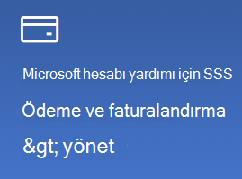

# Microsoft hesap bilgilerimi değiştirmeChange my Microsoft account information

[https://account.microsoft.com](https://account.microsoft.com/) adresine gidin ve gerekirse oturum açın.Go to [https://account.microsoft.com](https://account.microsoft.com/) and sign in if necessary. Bu seçenek hesap panonuza gitmenizi sağlar.This will take you to your account dashboard.  

**Ad ve kişisel bilgilerimi düzenle****Edit my name and personal information**

1. Hesap panonuzda, hesap resminiz ve adınız yanında, Profili düzenle\*\* seçeneğinin yanındaki > (diğer eylemler) tıklayın.On your account dashboard, next to your account picture and name, click the three dots (more actions) > Edit profile\*\*.
2. **Profili düzenle** sayfasında profil resminizi, adınızı, doğum tarihinizi, konumunuzu ve görüntüleme dili tercihinizi değiştirmek için verilen bağlantıları kullanın.On the **Edit profile** page, use the links provided to change your profile picture, name, date of birth, location, and display language preference. Xbox veya Skype hesabı profillerinizin bağlantılarını not alın; bu bağlantılarla ilgili hesapların ayrıntılarını değiştirebilirsiniz.Note the links to your Xbox or Skype account profiles, where you can change details specific to these accounts.

**E-posta adreslerini ve telefon numaralarını yönetme****Manage e-mail addresses and phone numbers**

Bir Microsoft hesabının "diğer adlar" olarak ilişkilendirilmiş bir veya birden fazla e-posta adresi veya telefon numarası vardır.A Microsoft account has one or more e-mail addresses or phone numbers associated with it as “aliases.” Bunları yönetmek için:To manage these:

1. Hesap panoda, hesap resminiz ve adınız yanında, Profili düzenle seçeneğinin yanındaki üç noktaya (diğer eylemler) > **tıklayın.**On your account dashboard, next to your account picture and name, click the three dots (more actions) > **Edit profile**.
2. **Profili düzenle** sayfasında, **Microsoft’ta oturum açma şeklinizi yönetin**’e tıklayın.On the **Edit profile** page, click **Manage how you sign in to Microsoft**. 
3. Burada hesap diğer adlarının listesini görürsünüz ve listeyi yönetebilir, e-posta adresleri ve telefon numaralarını ekleyip silebilirsiniz.You will see a list of account aliases, and you can manage the list, including adding and deleting e-mail addresses and phone numbers. Burada ayrıca hesapta oturum açmak için kullanılabilecek diğer adları, hangi diğer adın "birincil" olarak kabul edileceğini ve hangisinin Windows 10 cihazlarınızda görüntüleneceğini seçebilirsiniz.Here you can also select which aliases can be used to sign in to the account, and which alias is considered “primary,” which will be displayed on your Windows 10 devices.

**Ödeme yöntemlerini, faturalandırma için ad ve adres bilgilerini yönetme****Manage payment methods, as well as name and address for billing** 

1. Hesap panoda, hesap resminiz ve adınız yanında, Profili düzenle seçeneğinin yanındaki üç noktaya (diğer eylemler) > **tıklayın.**On your account dashboard, next to your account picture and name, click the three dots (more actions) > **Edit profile**.
2. **Ödeme ve faturalandırma** altında bulunan **Yönet**’i tıklayın.Under **Payment & billing** click **Manage**.

    

3. Burada ödeme yöntemleri ve ilişkili fatura adreslerini ekleyebilir, düzenleyebilir ve kaldırabilirsiniz.Here you can add, edit, and remove payment methods and their associated billing addresses. 
