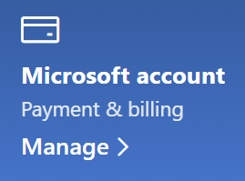

# Microsoft hesap bilgilerimi değiştirme

[https://account.microsoft.com](https://account.microsoft.com/) adresine gidin ve gerekirse oturum açın. Bu seçenek hesap panonuza gitmenizi sağlar.  

**Ad ve kişisel bilgilerimi düzenle**

1. Hesap panonuzda, hesap resminiz ve adınız yanında, Profili düzenle** seçeneğinin yanındaki > (diğer eylemler) tıklayın.
2. **Profili düzenle** sayfasında profil resminizi, adınızı, doğum tarihinizi, konumunuzu ve görüntüleme dili tercihinizi değiştirmek için verilen bağlantıları kullanın. Xbox veya Skype hesabı profillerinizin bağlantılarını not alın; bu bağlantılarla ilgili hesapların ayrıntılarını değiştirebilirsiniz.

**E-posta adreslerini ve telefon numaralarını yönetme**

Bir Microsoft hesabının "diğer adlar" olarak ilişkilendirilmiş bir veya birden fazla e-posta adresi veya telefon numarası vardır. Bunları yönetmek için:

1. Hesap panoda, hesap resminiz ve adınız yanında, Profili düzenle seçeneğinin yanındaki üç noktaya (diğer eylemler) > **tıklayın.**
2. **Profili düzenle** sayfasında, **Microsoft’ta oturum açma şeklinizi yönetin**’e tıklayın. 
3. Burada hesap diğer adlarının listesini görürsünüz ve listeyi yönetebilir, e-posta adresleri ve telefon numaralarını ekleyip silebilirsiniz. Burada ayrıca hesapta oturum açmak için kullanılabilecek diğer adları, hangi diğer adın "birincil" olarak kabul edileceğini ve hangisinin Windows 10 cihazlarınızda görüntüleneceğini seçebilirsiniz.

**Ödeme yöntemlerini, faturalandırma için ad ve adres bilgilerini yönetme** 

1. Hesap panoda, hesap resminiz ve adınız yanında, Profili düzenle seçeneğinin yanındaki üç noktaya (diğer eylemler) > **tıklayın.**
2. **Ödeme ve faturalandırma** altında bulunan **Yönet**’i tıklayın.

    

3. Burada ödeme yöntemleri ve ilişkili fatura adreslerini ekleyebilir, düzenleyebilir ve kaldırabilirsiniz. 
