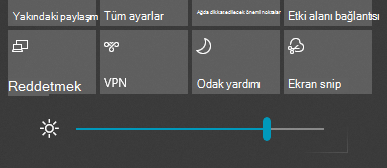

# Windows 10’da ekran parlaklığını değiştirmeChange screen brightness in Windows 10

Windows 10 sürümünüz 1903 sürümünden yeni ise, işlem merkezinde **Parlaklık kaydırıcısı** bulunur.If your Windows 10 is newer than version 1903, it has a **Brightness slider** in the action center. İşlem merkezini açmak için görev çubuğunun en sağ tarafındaki **Bildirim** düğmesine tıklayın veya klavyenizde **Windows home + A** tuşlarına basın.To open the action center, click the **Notification** button at the rightmost side of your taskbar, or press **Windows home + A** on your keyboard.

Windows 10 sürümünüz daha eski bir sürümse Parlaklık kaydırıcısını **[Ayarlar > Sistem > Ekran>](ms-settings:display?activationSource=GetHelp)** bölümünde bulabilirsiniz.If your Windows 10 is an earlier version, you can find the brightness slider by going to **[Settings > System > Display](ms-settings:display?activationSource=GetHelp)**.

**Notlar**:**Notes**:

- Harici monitöre sahip masaüstü bilgisayarlarda Yerleşik ekran için parlaklığı değiştir kaydırıcısını göremeyebilirsiniz.You might not see the Change brightness for the built-in display slider on desktop PCs that have an external monitor. Harici bir monitörde parlaklığı değiştirmek için monitör üzerindeki denetimleri kullanın.To change the brightness of an external monitor, use the controls on the monitor.
- Masaüstü bilgisayarınız yoksa ve kaydırıcı görünmüyorsa veya çalışmıyorsa, ekran sürücüsünü güncelleştirmeyi deneyin.If you don't have a desktop PC and the slider doesn't appear or work, try updating the display driver. Görev çubuğundaki arama kutusuna **Aygıt Yöneticisi** yazın ve ardından sonuç listesinden **Aygıt Yöneticisi**’ni seçin.In the search box on the taskbar, type **Device Manager**, and then select **Device Manager** from the list of results. **Aygıt Yöneticisi**’nde **Görüntü bağdaştırıcıları**’nı, ardından görüntü bağdaştırıcısını seçin.In **Device Manager**, select **Display adapters**, then select the display adapter. Görüntü bağdaştırıcısına basılı tutun (veya sağ tıklayın) ve **Sürücüyü güncelleştir**’i seçin; ardından yönergeleri izleyin.Press and hold (or right-click) the display adapter name and click **Update driver**; then follow the instructions.
