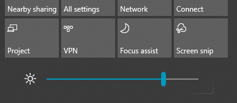

# Windows 10’da ekran parlaklığını değiştirme

Windows 10 sürümünüz 1903 sürümünden yeni ise, işlem merkezinde **Parlaklık kaydırıcısı** bulunur. İşlem merkezini açmak için görev çubuğunun en sağ tarafındaki **Bildirim** düğmesine tıklayın veya klavyenizde **Windows home + A** tuşlarına basın.

Windows 10 sürümünüz daha eski bir sürümse Parlaklık kaydırıcısını **[Ayarlar > Sistem > Ekran>](ms-settings:display?activationSource=GetHelp)** bölümünde bulabilirsiniz.

**Notlar**:

- Harici monitöre sahip masaüstü bilgisayarlarda Yerleşik ekran için parlaklığı değiştir kaydırıcısını göremeyebilirsiniz. Harici bir monitörde parlaklığı değiştirmek için monitör üzerindeki denetimleri kullanın.
- Masaüstü bilgisayarınız yoksa ve kaydırıcı görünmüyorsa veya çalışmıyorsa, ekran sürücüsünü güncelleştirmeyi deneyin. Görev çubuğundaki arama kutusuna **Aygıt Yöneticisi** yazın ve ardından sonuç listesinden **Aygıt Yöneticisi**’ni seçin. **Aygıt Yöneticisi**’nde **Görüntü bağdaştırıcıları**’nı, ardından görüntü bağdaştırıcısını seçin. Görüntü bağdaştırıcısına basılı tutun (veya sağ tıklayın) ve **Sürücüyü güncelleştir**’i seçin; ardından yönergeleri izleyin.
