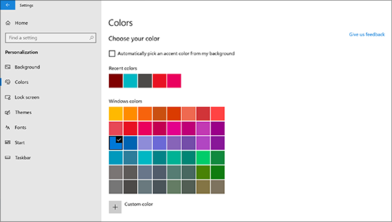
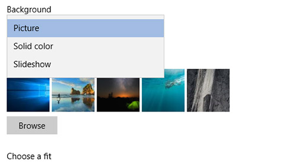

# Masaüstü arka planınızı ve renklerinizi değiştirmeChange your desktop background and colors

Renk ayarınızı değiştirmek için Başlangıç Ayarları Kişiselleştirme Renkleri seçeneğine gidin ve kendi renginizi seçin veya Windows'un arka planından bir  >    >    >  vurgu rengi seçmesine izin bırakın.To change your colors setting, go to **Start** > **Settings** > **Personalization** > **Colors**, and then choose your own color or let Windows pull an accent color from your background.

Masaüstü arka planınızı değiştirmek için Başlangıç Ayarları Kişiselleştirme Arka Planı seçeneğine gidin ve bir resim, düz renk seçin  >    >    >  veya resimlerden bir slayt gösterisi oluşturun.To change your desktop background, go to **Start** > **Settings** > **Personalization** > **Background**, and then choose a picture, solid color, or create a slideshow of pictures. 

Daha fazla masaüstü arka planı ve rengi mi var?Want more desktop backgrounds and colors? Onlarca ücretsiz tema seçmek için [Microsoft Store'u](https://www.microsoft.com/store/collections/windowsthemes) ziyaret edin.Visit [Microsoft Store](https://www.microsoft.com/store/collections/windowsthemes) to choose from dozens of free themes.
