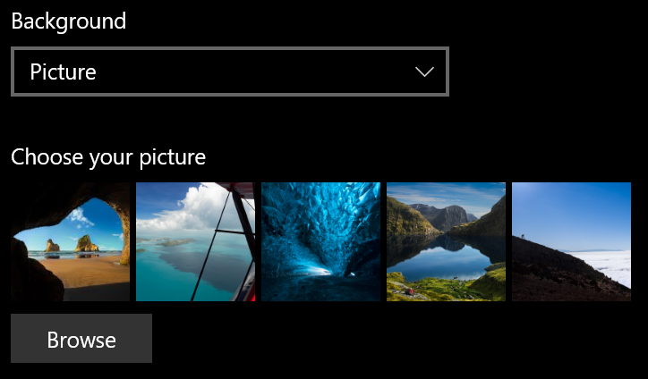
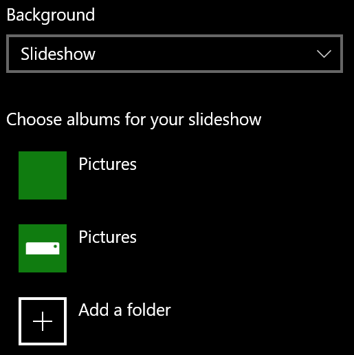

# Kilit ekranı arka planınızı değiştirme

- Ayarlar Kişiselleştirme  >  **Kilit**  >  **ekranı'ne gidin.** Ya da buraya tıklayın veya [dokunun.](ms-settings:lockscreen?activationSource=GetHelp)

- Özel bir arka plan resmi ayarlamak **için** Arka plan açılır **listesinden** Resim'i seçin ve sonra da Resme **gözat'ı** seçin.

  

- Özel resimlerden bir slayt gösterisi  ayarlamak  için Arka Plan açılan listesinden Slayt Gösterisi'ne tıklayın ve bir albüm seçin veya slayt gösterisinin resimlerini içeren bir klasör ekleyin.

  
