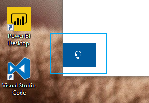

# Kulaklık düğmesine tıklayarak bize ulaşınContact us by clicking the headphone button

Microsoft desteğine başvurmak istiyorsanız, lütfen bu uygulamanın sol alt köşesindeki **bize ulaşın** seçeneğine tıklayın.If you'd like to contact Microsoft Support, please click **Contact us** in the lower left corner of this app. Dışarı geçmiş penceresinin içinde, ürün ve sorun kategorisini seçtikten sonra doğru destek kanalına yönlendirilirsiniz.Inside the fly-out window, you will be guided to the right support channel after choosing your product and issue category.

Bize bir kişi oturumu başlattıktan sonra da uygulamanın geri kalanıyla etkileşimde bulunabilirsiniz.You can keep interacting with the rest of the app even after you have initiated a Contact us session. Bize ulaşın paneli, uygulamanın içinde başka bir yere tıklayarak geçici olarak simge durumuna küçültülmüş olabilir.The Contact us panel can be temporarily minimized by clicking anywhere else inside the app. Aynı oturuma dönmek için **bize şimdi ulaşın** 'ı tıklatın.To return to the same session, just click **Contact us** again.
