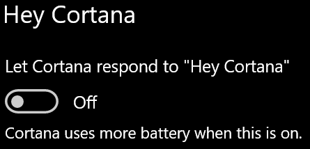

# Cortana benimle konuşmuyor ya da duyamıyor.

Görev çubuğundaki Cortana düğmesini veya Cortana panelindeki mikrofon düğmesini seçmeden Cortana ile konuşmanızı sağlayan "Hey Cortana" özelliğini kullanmaya çalışıyorsanız, özelliğin etkinleştirildiğinden onaylayın:

1. **Başlat'a**gidin, ardından **[Cortana > Ayarlar'ı](ms-settings:cortana?activationSource=GetHelp)** seçin.
2. **Hey Cortana**altında, **Let Cortana geçiş "Hey Cortana"** **Açık**geçiş .

**Gizlilik ayarlarınız Cortana'nın sizi duymasını engelliyor mu?**

Gizlilik ayarlarınız Cortana'nın sesinize yanıt vermesini engelleyebilir.
- Çevrimiçi Konuşma tanımanın açık olduğundan emin olun:
    - **Başlat'a**gidin, ardından **[Ayarlar > Gizlilik > Konuşma'yı](ms-settings:privacy-speech?activationSource=GetHelp)** tıklatın.
    - **Çevrimiçi konuşma tanıma**altında, ayarı **Açık**olarak değiştirin.
- Cortana'nın mikrofonunuza erişmek için izni olduğundan emin olun. 
    - Başlat'a gidin, ardından **[Ayarlar > Gizlilik > Mikrofon'u](ms-settings:privacy-microphone?activationSource=GetHelp)** tıklatın.
    - **Hangi uygulamaların mikrofonunuza erişebileceğini seçin,** uygulamalar ve hizmetler listesinde **Cortana'yı** arayın ve **anahtarın Açık'a**geçtiğinden emin olun.

Ayrıca, lütfen hoparlörlerinizin veya mikrofonlarınızın Cortana ile konuşmak için açık ve çalışır durumda olduğundan da emin olun.
