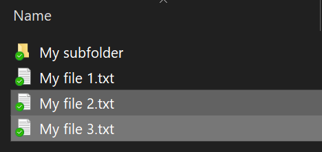

# Windows 10'da dosyaları veya klasörü şifreleme

BitLocker kullanarak diskin tamamını şifrelebilirsiniz, ancak yalnızca tek tek dosyaları veya klasörleri (ve bunların içeriğini) şifrelemek için:

1. Dosya **Gezgini'nde** şifrelemek istediğiniz dosyaları/klasörleri seçin. Bu örnekte iki dosya seçilmiştir:

    

2. Seçili dosyalara sağ tıklayın ve Özellikler'e **tıklayın.**

3. Özellikler penceresinde **Gelişmiş'e** **tıklayın.**

4. Gelişmiş Özellikler **penceresinde** Veri güvenliğini sağlamak **için içerikleri şifrele onay** kutusunu seçin:

    

5. **Tamam**'a tıklayın.
