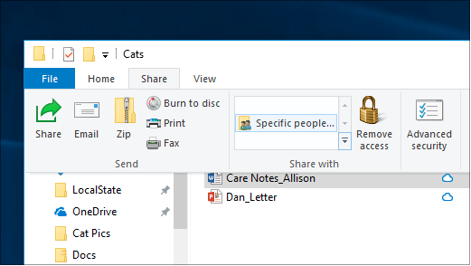
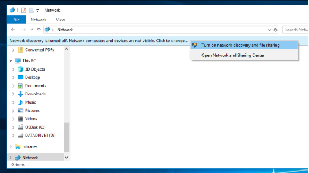

# Windows 10'da ağ üzerinden dosya paylaşımıFile sharing over a network in Windows 10

**Not**: Daha önce dosya paylaşımı için HomeGroup'u kullandıysanız, HomeGroup'un Windows 10'dan kaldırıldığını lütfen unutmayın (Sürüm 1803).**Note**: If you previously used HomeGroup for file sharing, please note that HomeGroup has been removed from Windows 10 (Version 1803). Artık Windows 10'da yerleşik özellikleri kullanarak yazıcıları ve dosyaları paylaşabilirsiniz.You can now share printers and files by using built-in features in Windows 10.

**Ağ üzerinden dosya veya klasör paylaşmak için****To share files or folders over a network**

- **Dosya Gezgini'nde,** bir dosya seçin > üstteki **Paylaş** sekmesini tıklatın > **Bölümü'nde** Paylaş sekmesini tıklatın, **Belirli kişiler'i**tıklatın.In **File Explorer**, select a file > click the **Share** tab at the top > in the **Share with** section, click **Specific people**.

    
          
- Aynı anda birden çok dosya seçerseniz, hepsini aynı şekilde paylaşabilirsiniz.If you select multiple files at once, you can share them all in the same way. Klasörler için de çalışır.It works for folders, too.

**Ağda dosya paylaşan aygıtları görmek için****To see devices on the network that are sharing files**

- **Dosya Gezgini'nde,** **Ağ'a**gidin.In **File Explorer**, go to **Network**. Ağ keşfi etkin değilse, "Ağ bulma kapatılır" bir hata iletisi görürsünüz.If Network discovery is not enabled, you will see an error message "Network discovery is turned off..."

- Ağ keşfini tıklatın banner **kapatılır,** ardından **ağ bulma ve dosya paylaşımını aç'ı**tıklatın.Click the **Network discovery is turned off** banner, then click **Turn on network discovery and file sharing**.

    

[Ağ üzerinden dosya paylaşımı hakkında daha fazla bilgi edininRead more about file sharing over a network](https://support.microsoft.com/help/4092694/windows-10-file-sharing-over-a-network)

[Uygulamaları, OneDrive'ı, e-postaları ve daha fazlasını kullanarak dosyaları paylaşınShare files using apps, OneDrive, emails, and more](https://support.microsoft.com/help/4027674/windows-10-share-files-in-file-explorer)
