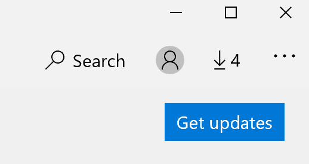

# Uygulamaların görüntüleme dilini DüzeltmeFix the display language of apps

Windows 10 ' da görüntüleme dilini değiştirdikten sonra, bazı uygulamalar bunları açtığınızda önceki dili kullanmaya devam edebilir.After you change the display language in Windows 10, some apps may still use the previous language when you open them. Bunun nedeni, bu dilin uygulamalarının yeni sürümlerinin mağazadan indirilmesidir.This happens because new versions of the apps for that language must be downloaded from the Store. Bu sorunu çözmek için, otomatik güncelleştirmeyi bekleyebilir veya uygulamaların güncelleştirilmiş sürümünü el ile yükleyebilirsiniz.To fix this problem, you can either wait for the automatic update, or you can manually install the updated version of the apps.

Güncelleştirmeyi el ile yüklemek için, **Microsoft Store** 'u açın ve sağ üst köşedeki **indirmeler ve güncelleştirmeler** 'e tıklayın.To manually install the update, open **Microsoft Store** and click **Downloads and updates** in the top right corner. Ardından **güncelleştirmeleri al**'ı tıklatın.Then click **Get updates**. Güncelleştirme tamamlandıktan sonra dil değiştirilmediyseniz bilgisayarınızı yeniden başlatmayı deneyin.If the language is not changed after the update is complete, try restarting your PC.

Giriş ve görüntüleme dil ayarları hakkında daha fazla bilgi için [Windows 10 ' da giriş ve görüntü dil ayarlarınızı yönetme](https://support.microsoft.com/help/4027670/windows-10-add-and-switch-input-and-display-language-preferences)bölümüne bakın.To read more about input and display language settings, see [Manage your input and display language settings in Windows 10](https://support.microsoft.com/help/4027670/windows-10-add-and-switch-input-and-display-language-preferences).
