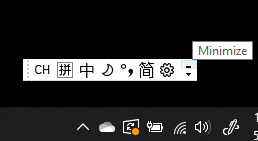
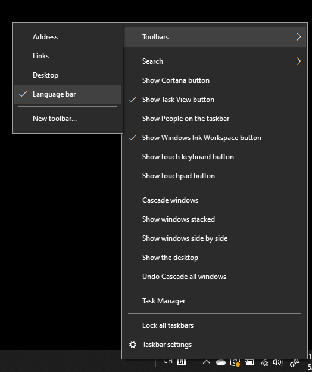
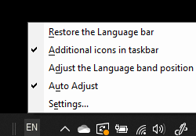

# Dil çubuğunu gizleme, görüntüleme veya sıfırlama

**Dil çubuğunu simge durumuna küçültmek için:**

Dil çubuğunun sağ üst köşesindeki simge durumuna küçült düğmesine tıklayabilirsiniz. Öte ya da dil çubuğunu görev çubuğuna sürükleyebilirsiniz; bu da otomatik olarak simge durumuna küçültülmüş olur.

**Dil çubuğunu doldurmak için:**

Dil çubuğunu görev çubuğuna sabitlemek istemiyorsanız, görev çubuğundaki boş alana sağ tıklayın  ve Araç Çubukları menüsünde Dil çubuğu seçeneğinin işaretini kaldırın. Bu, dil çubuğunun görev çubuğunun önceki ekran görüntüsü gibi görev çubuğunun dışında görünmesini sağlar.

**Dil çubuğunu varsayılan olarak geri yüklemek için:**

Araç çubuğundaki dil düğmesine sağ tıklayın ve menüde **Dil çubuğu seçeneğini geri yükle'ye** tıklayın. Bu, varsayılan olarak geri yüklemektir.

