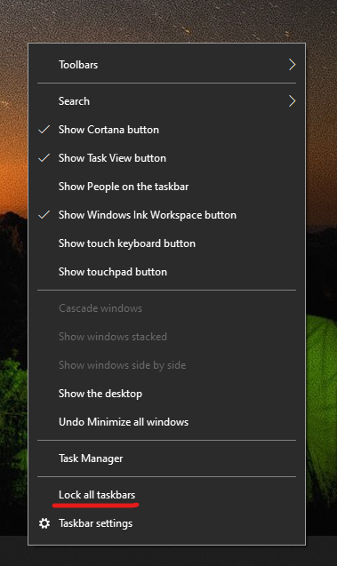

# Görev çubuğunu masaüstünüzde bir yere ya da en üstüne taşıma

Öncelikle görev çubuğunun kilidinin açık olduğunu onaylayın. Sizinkinin kilidinin açık olup olmadığını bulmak için görev çubuğundaki  boş alana sağ tıklayın ve Görev çubuğunu kilitlemek için yanında bir onay işareti olup olmadığını kontrol edin. Onay işareti varsa görev çubuğu kilitlidir ve taşınamaz. Görev **çubuğunu bir kez kilitle'ye** tıklarken kilidi açılır ve onay işareti kaldırabilirsiniz.

Görev çubuğunu görüntüleyen birden fazla monitör varsa Tüm görev çubuklarını **kilitle 'i görürsünüz.**

Görev çubuğunun kilidini kaldırktan sonra, görev çubuğundaki boş bir alana basılı tutabilir ve bunu ekranda istediğiniz konuma sürükleyebilirsiniz. Bunu ayrıca, görev çubuğundaki herhangi bir boş alana sağ tıklayarak ve Görev çubuğu ayarları'> görev çubuğu ** konumunu kullanarak da yapabilirsiniz.**
