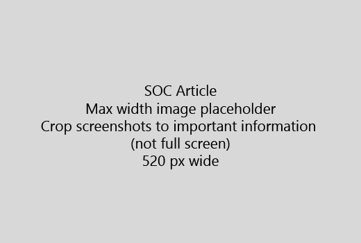

Makalenizi çok kısa bir giriş (1. cümle) ile başlatın. Kendinizi okuyucunun - yararlanılmasını neden burada olduklarını? Yapması gerekenler? 
  
1. Hızlı bir görevi yerine getirmek için gerekli adımları listesine düz öğrenin.
    
    Bir kavramı açıklamak gereksinim duyduğunuz ya da önceden gerekli adımları yapmak sahip oldukları ve kavram veya adımları [bağlantı](https://support.office.com/article/f37e7984-cf03-4fde-92d3-82970d7e241b.aspx) gereken yeri adım aşağıda hızlı bir Özet ekleyin. 
    
2. Yordamlar kısa - tercihen 5 veya daha az adım, en fazla 8 tutun.
    
3. **UI Stili** kullanmak için kullanıcı arabirimi öğeleri veya metni kişilerin girmeniz gerekir. 
    
4. Fiiller seçin, Seç veya eylemler olarak girin ve menü **menü** olarak biçimlendirmek kullan \> **komutu**.
    
5. İsteğe bağlı olarak, bağlam için bir ekran görüntüsü (kullanıcı Arabirimi bulmak sabit veya görevi tamamlamak için gerekli olan varsa) ekleyin.
    
    En fazla genişlik: 520 piksel. Standart bir tema kullanmak, değil herhangi bir kişisel bilgi göster ve yalnızca ilgili nedir göstermek için kırpma. 
    
    
  
[Adımlar ve video kılavuz örnek](https://support.office.com/article/14ce8e82-efa0-47f5-bb84-94f078db3dae.aspx)video veya ekran görüntüsü eklemek, iki sütun kılavuzunu kullanın ve ekran görüntüsü - sağ veya sol ve video adımları sahip olmasını istiyorsanız, bkz. 
  
Bir makale için 500'den fazla sözcük hedefleyin.
  
# Örnek makale

[Benim fotoğraf değiştirme](https://support.office.com/article/555376e0-1fca-49ba-8434-307a0525c767.aspx)
  

