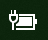

# Pil veya güç simgesi Windows 10

Windows 10 cihazınızın pili varsa (örneğin, dizüstü bilgisayar veya tablet veya UPS'ye USB ile bağlı bir bilgisayar), normalde saatin yakınında görev çubuğunda bir güç/pil simgesi gösterilir; örneğin:

Bu simgeyi görmüyorsanız gizlenmiş olabilir:

1. Görev **[çubuğunda Ayarlar > kişiselleştirme > gidin.](ms-settings:taskbar?activationSource=GetHelp)**

2. Bildirim alanında Görev çubuğunda görünecek **simgeleri seçin seçeneğine tıklayın.**

3. Ardından listede **Güç** öğesini bulun ve bu öğenin ayarını Açık olarak **değiştir.**

    

**Sorun giderme**

Yukarıdaki yönergeleri izlediysanız ve **Güç** geçiş düğmesi gri görünüyor veya görünmüyorsa, görev çubuğundaki arama kutusuna  cihaz yöneticisi yazın ve ardından sonuç listesinde Cihaz Yöneticisi'ni seçin. Piller **altında** cihazınızın pil seçeneğine sağ tıklayın, Devre dışı bırak'a **ve** Evet'e **tıklayın.** Birkaç saniye bekleyin, ardından pile sağ tıklayın ve Etkinleştir'e **tıklayın.** Ardından cihazınızı yeniden başlatın.

Yukarıdaki yönergeleri izlediysiniz ancak pil simgesi görev çubuğunda görünmüyorsa görev çubuğundaki arama kutusuna görev yöneticisi  yazın ve ardından sonuç listesinde Görev Yöneticisi'ne tıklayın. İşlemler **sekmesindeki** Ad'ın **altında Gezgin'e** sağ **tıklayın ve** yeniden başlat'a **tıklayın.**
