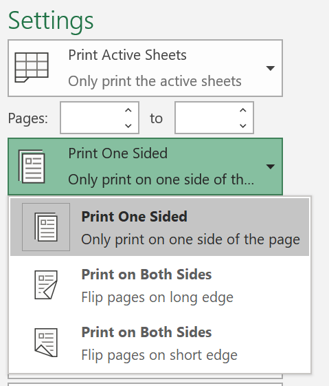

# Kağıdın her iki tarafına da yazdırma (çift yönlü yazdırma)

**Yazıcım çift yönlü yazdırma özelliği var mı?**

Yazıcınızın özellik özeti veya el kitabı, "çift yönlü yazdırma" olarak da bilinen kağıdın her iki tarafına da yazdırma özelliğinin olup olmadığını size söylemeli. Microsoft Office'i biliyorsanız bunu bulmanın bir diğer yolu, Word veya Excel gibi bir Office uygulaması'ı açmak, Dosya **>** Yazdır'a gidip doğru yazıcının seçili olduğundan emin olmak ve bu bölümde Ayarlar bulmaktır. Örneğin: 

**Çift yönlü yazdırma Microsoft Office**

Yazıcınız iki kenardan da yazdıra uygunsa, Office uygulaması'de Dosya **>** Yazdır'a giderseniz, yukarıdaki örnekte gösterildiği gibi "İki Kenarda Yazdır" seçeneğini de görebilirsiniz.  İstediğiniz çift yönlü yazdırma türünü seçin (uzun kenarında çevir veya kısa kenarından çevir) ve **yazdır'ı** tıklatın ve çıktıyı başlatmak için Yazdır'ı tıklatın.

**Herhangi bir uygulamada çift yönlü yazdırma**

Birçok uygulama yazdırılırken aşağıdakine benzer genel bir yazdırma iletişim kutusu görüntülenir: 

Doğru yazıcının seçili olduğundan emin olun ve ardından **Tercihler'e** tıklarsanız yazıcı tercihleri penceresini açın. Yazıcı çift yönlü yazdırma özelliğine sahipse, geçerli yazdırma işinin bu özelliği etkinleştirme özelliği bu pencerede gösterilir.
