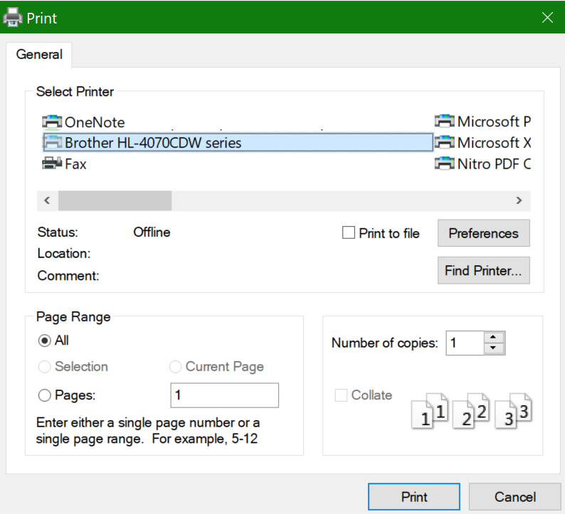

# Kağıdın her iki tarafına da yazdırma (çift yönlü yazdırma)Printing on both sides of paper (duplex printing)

**Yazıcım çift yönlü yazdırma özelliği var mı?****Is my printer capable of duplex printing?**

Yazıcınızın özellik özeti veya el kitabı, "çift yönlü yazdırma" olarak da bilinen kağıdın her iki tarafına da yazdırma özelliğinin olup olmadığını size söylemeli.Your printer’s feature summary or manual should tell you whether it is capable of printing on both sides of the paper, also known as “duplex printing.” Microsoft Office'iniz varsa, bunu bulmanın bir diğer yolu da Word veya Excel gibi bir Office uygulamasını açmak, Dosya **>** Yazdır'a gidip doğru yazıcının seçili olduğundan emin olmak ve Ayarlar bölümünde ilgili özelliği bulmaktır.If you have Microsoft Office, another way to find out is by opening an Office app like Word or Excel, going to **File > Print**, making sure the right printer is selected, and looking for the capability in the Settings section. Örneğin:For example: 

**Microsoft Office'te çift yönlü yazdırma****Duplex printing in Microsoft Office**

Yazıcınız her iki tarafta da yazdırılabilirse, Office uygulamasında Dosya **>** Yazdır'a giderseniz, yukarıdaki örnekte gösterildiği gibi "İki Kenarda Yazdır" seçeneğini de görebilirsiniz.If your printer is capable of printing on both sides, when you go to **File > Print** in the Office app, you will see an option to “Print on Both Sides,” as shown in the example above.  İstediğiniz çift yönlü yazdırma türünü seçin (uzun kenarında çevir veya kısa kenarından çevir) ve **yazdır'ı** tıklatın ve çıktıyı başlatmak için Yazdır'ı tıklatın.Select the type of duplex printing you want (flip on long edge, or flip on short edge), and click **Print** to start the printout.

**Herhangi bir uygulamada çift yönlü yazdırma****Duplex printing from any application**

Birçok uygulama yazdırılırken aşağıdakine benzer genel bir yazdırma iletişim kutusu görüntülenir:In many apps when you print you will see a general print dialog that looks like this: 

Doğru yazıcının seçili olduğundan emin olun ve ardından **Tercihler'e** tıklarsanız yazıcı tercihleri penceresini açın.Make sure the right printer is selected, then click **Preferences** to open the printer preferences window. Yazıcı çift yönlü yazdırma özelliğine sahipse, geçerli yazdırma işinin bu özelliği etkinleştirme özelliği bu pencerede gösterilir.If the printer is capable of duplex printing, the ability to enable this for the current print job will show in that window.
