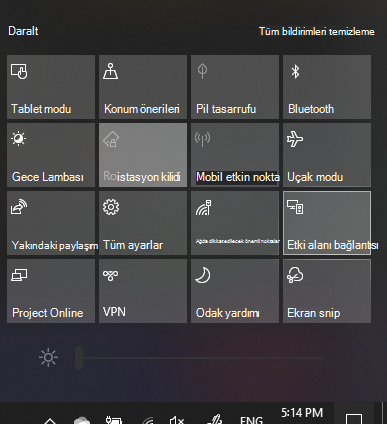

# Bir PC 'ye ProjectProject to a PC

Hedef aygıtınızda (yansıtma hedefi), **Bu bilgisayara Yansıtımın**ayarlar sayfasını açmak Için "yansıtma ayarları" ifadesini arayın.On your destination device (projecting to), search for "Projection Settings" to open the Settings page of **Projecting to this PC**. Aşağıdakileri yapın:Then make sure that:
- "Bazı Windows ve Android cihazları, bu bilgisayarda tamam olduğunu söyleydüğünüzde bu bilgisayara Project tarafından **görüntülenebilir.**"Some Windows and Android devices can project to this PC when you say it's OK" drop-down menu is set to **Always Off**.
- "Bu bılgısayarda Project 'i sor" açılan menüsü **bağlantı her gerektiğinde**ayarlanır."Ask to project to this PC" drop-down menu is set to **Every time a connection is required**.
- "Eşleştirme için PIN gerektir" açılan menüsü **hiçbir zaman**olarak ayarlanmıştır."Require PIN for pairing" drop-down menu is set to **Never**.

Hedef cihazınızda, **Başlat** 'a gidip "Bağlan" Ifadesini arayarak **Connect** uygulamasını başlatın.On your destination device, launch **Connect** app by going to **Start** and search for "Connect".

Ardından, kaynak cihazınızda, projeyeThen, on your source device that you are trying to project from:

1. Işlem merkezi 'ni açmak için **Windows tuşu + A** tuşlarına basın.Press **Windows key + A** to open Action Center.
2. **Bağlan**'ı tıklatın.Click **Connect**.
3. Ekranı projeye eklemek istediğiniz cihazı tıklatın.Click the device you want to project the screen to.

Yukarıdaki adımlardan sonra, hedef aygıtınızın kaynak aygıtın ekranını ikincil bir monitörde olduğu gibi görüntülemesi gerekir.After the above steps, your destination device should display the screen of the source device as if it is a secondary monitor.
