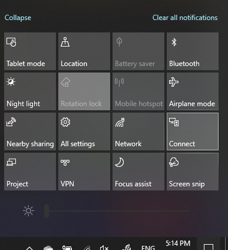

# Project bilgisayara yükleme

Hedef aygıtınızda (yansıtma hedefi), bu bilgisayara yansıtmanın Ayarlar sayfasını açmak için "Yansıtma Ayarlar" **araması yapabilirsiniz.** Ardından şunları emin olun:
- "Bazı Windows Android cihazları, sorun değil de, bu bilgisayara projesi olabilir" açılan menüsü Her Zaman Kapalı **olarak ayarlanmıştır.**
- Bağlantı her gerektiğinde "Bu bilgisayara proje yapmak için sor" açılan menüsü **olarak ayarlanmıştır.**
- "Eşleştirme için PIN gerektir" açılan menüsü Hiçbir Zaman olarak **ayarlanmış.**

Hedef aygıtınızda, Başlangıç **Bağlan'ne** gidip  "Uygulama" için arama yapmaya Bağlan.

Ardından, kaynak aygıtınızda şu kaynak cihazdan proje yapmaya çalışıyor olun:

1. İşlem **Windows + A tuşlarına** basın.
2. **Ekle'Bağlan** tıklayın.
3. Ekrana projek istediğiniz cihazı tıklatın.

Yukarıdaki adımlardan sonra, hedef cihazınızın ikincil bir monitör gibi kaynak cihazın ekranı görüntülemesi gerekir.
