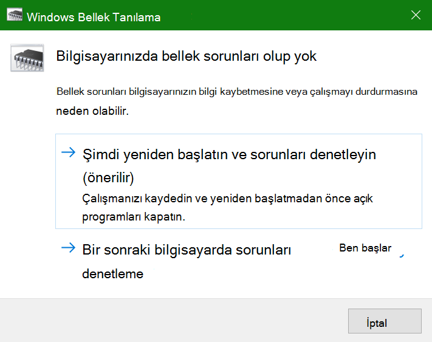
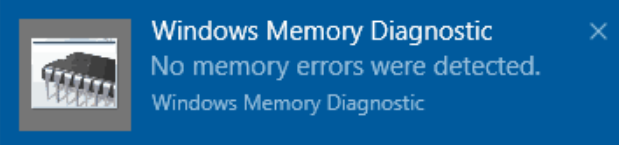

# Windows'de Bellek Tanılama'yı Windows 10

Bilgisayarınız Windows uygulamalar kilitlenmeye, donuyor veya kararsız bir şekilde davranıyorsa, bilgisayarınızın belleğinde (RAM) bir sorun olabilir. Bilgisayarınızın RAM'Windows sorunları kontrol etmek için Bellek Tanılama aracında çalıştırabilirsiniz.

Görev çubuğunuzda arama kutusuna bellek tanılama **yazın ve bellek** tanılamayı Windows **seçin.** 

Tanılamayı çalıştırmak için bilgisayarın yeniden başlatılması gerekiyor. Hemen yeniden başlatma seçeneğiniz vardır (lütfen çalışmanızı kaydedin ve önce açık belgeleri ve e-postaları kapatın) veya bilgisayarı bir sonraki yeniden başlatma işlemi sırasında tanılamanın otomatik olarak çalışacak şekilde zamanlamayı deneyin:

Bilgisayar yeniden başlatıldığında, Windows **Tanılama Aracı otomatik** olarak çalışır. Tanılamalar çalıştırılıyorken durum ve ilerleme durumu görüntülenir ve klavyenizde **ESC** tuşuna basarak tanılamayı iptal seçeneğiniz vardır.

Tanılama tamamlandığında, Windows başlayacaktır.
Yeniden başlatmanın hemen ardından Masaüstü görüntülendiğinde, herhangi  bir bellek hatası bulunıp buluna olmadığını göstermek için bir bildirim (görev çubuğundaki İşlem Merkezi simgesinin yanında) gösterilir. Örneğin:

İşte İşlem Merkezi simgesi:  

Ve örnek bir bildirim: 

Bildirimi kaçırdıysanız, İşlem Merkezi'yi görüntülemek ve kaydırılabilir  bir bildirim listesi görmek için görev çubuğunda İşlem Merkezi simgesini seçebilirsiniz. 

Ayrıntılı bilgileri gözden geçirmek için, **görev çubuğunuzda** arama kutusuna olayı yazın ve ardından Olay **Görüntüleyicisi'ni seçin.** Olay **Görüntüleyicisi'nin** sol bölmesinde, Günlükler ve Sistem **Windows'> gidin.** Sağ bölmede, Kaynak sütununa bakarak listeyi  aşağı doğru tarayın; Kaynak değeri **MemoryDiagnostics-Results** ile ilgili olayları görene kadar. Bu tür olayları vurgulayın ve listenin altındaki Genel sekmesinin **altındaki** kutuda sonuç bilgilerini görüntüleyin.
