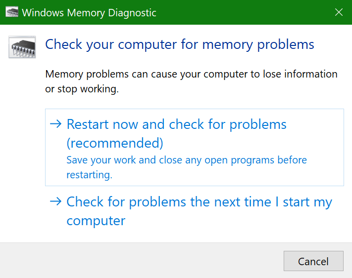

# Windows 10'da Windows Bellek Tanılama'yı çalıştırmaRun Windows Memory Diagnostics in Windows 10

Bilgisayarınızdaki Windows ve uygulamalar çöküyorsa, donuyorsa veya kararsız bir şekilde hareket ediyorsa, bilgisayarın belleğinde (RAM) sorun yaşayabilirsiniz.If Windows and apps on your PC are crashing, freezing, or acting in an unstable manner, you may have a problem with the PC’s memory (RAM). Bilgisayarın RAM'iyle ilgili sorunları denetlemek için Windows Memory Diagnostic'i çalıştırabilirsiniz.You can run the Windows Memory Diagnostic to check for problems with the PC’s RAM.

Görev çubuğunuzdaki arama kutusunda **bellek tanılama**yazın ve ardından **Windows Memory Diagnostic'i**seçin.In the search box on your taskbar, type **memory diagnostic**, and then select **Windows Memory Diagnostic**. 

Tanılamayı çalıştırmak için bilgisayarın yeniden başlatılması gerekir.To run the diagnostic, the PC needs to restart. Hemen yeniden başlatma seçeneğiniz vardır (lütfen önce çalışmanızı kaydedin ve açık belgeleri ve e-postaları kapatın) veya bilgisayarı bir sonraki kez yeniden başlatında otomatik olarak çalışacak tanılamayı zamanlayın:You have the option to restart immediately (please save your work and close open documents and e-mails first), or schedule the diagnostic to run automatically the next time the PC restarts:

BILGISAYAR yeniden başlatıldığında, **Windows Bellek Tanılama Aracı** otomatik olarak çalışır.When the PC restarts, the **Windows Memory Diagnostics Tool** will run automatically. Durum ve ilerleme tanılama çalıştırılınrken görüntülenir ve klavyenizdeki **ESC** tuşuna basarak tanılamayı iptal etme seçeneğiniz vardır.Status and progress will be displayed as the diagnostics run, and you have the option of cancelling the diagnostics by hitting the **ESC** key on your keyboard.

Tanılama tamamlandığında, Windows normal olarak başlar.When the diagnostics are complete, Windows will start normally.
Yeniden başlatmadan hemen sonra, Masaüstü göründüğünde, bellek hataları nın bulunup bulunmadığını belirtmek için bir bildirim (görev çubuğundaki **İşlem Merkezi** simgesinin yanında) görüntülenir.Immediately after restart, when the Desktop appears, a notification will appear (next to the **Action Center** icon on the taskbar), to indicate whether any memory errors were found. Örneğin:For example:

İşte İşlem Merkezi simgesi:Here's the Action Center icon:  

Ve örnek bir bildirim:And a sample notification: 

Bildirimi kaçırdıysanız, **İşlem Merkezi'ni** görüntülemek ve kaydırılabilir bir bildirim listesini görmek için görev çubuğundaki **İşlem Merkezi** simgesini seçebilirsiniz.If you missed the notification, you can select the **Action Center** icon  on the taskbar to display the **Action Center** and see a scrollable list of notifications.

Ayrıntılı bilgileri gözden geçirmek için görev çubuğunuzdaki arama kutusuna **olay** yazın ve ardından **Olay Görüntüleyicisi'ni**seçin.To review detailed information, type **event** into the search box on your taskbar, and then select **Event Viewer**. Olay **Görüntüleyicisi'nin**sol bölmesinde, **Windows Günlükleri > Sistemi'ne**gidin.In the **Event Viewer**’s left-hand pane, navigate to **Windows Logs > System**. Sağ bölmede, Kaynak değeri **MemoryDiagnostics-Results**olan olayları görene kadar **Kaynak** sütuna bakarken listeyi aşağı tarayın.In the right-hand pane, scan down the list while looking at the **Source** column, until you see events with Source value **MemoryDiagnostics-Results**. Bu tür her bir olayı vurgulayın ve listenin altındaki **Genel** sekmesinin altındaki kutuda sonuç bilgilerini görün.Highlight each such event and see the result information in the box under the **General** tab below the list.
