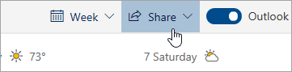

# Web'de Outlook ile paylaşmaSharing with Outlook on the web

Takviminizden, sayfanın üst kısmındaki araç çubuğunda **Paylaş'ı**seçin ve paylaşmak istediğiniz takvimi seçin.From your Calendar, on the toolbar at the top of the page, select **Share**, and choose the calendar you want to share.

    

**Not**: Başka kişilere ait takvimleri paylaşamazsınız.**Note**: You can't share calendars owned by other people.

- Takviminizi paylaşmak istediğiniz kişinin adını veya e-posta adresini girin.Enter the name or email address of the person you want to share your calendar with.
- Kişinin takviminizi nasıl kullanmasını istediğinizi seçin:Choose how you want the person to use your calendar:
    - Meşgul olduğumda **görüntüleyebilir**   meşgul olduğunuzu görmelerini sağlar, ancak etkinlik konumu gibi ayrıntıları içermez.**Can view when I'm busy** lets them see when you're busy but doesn't include details like the event location.
    - **Başlıkları ve konumları**   görüntüleyebilirsiniz meşgul olduğunuzda, etkinliklerin başlığını ve konumunu görmelerini sağlar.**Can view titles and locations** lets them see when you're busy, as well as the title and location of events.
    - **Tüm ayrıntıları**   görüntüleyebilirsiniz etkinliklerinizin tüm ayrıntılarını görmelerini sağlar.**Can view all details** lets them see all the details of your events.
    - **Dolandırabilirsiniz**   takviminizi de vermelerini sağlar.**Can edit** lets them edit your calendar.
    - **Temsilci**   takviminizi ve takviminizi başkalarıyla paylaşmalarını sağlar.**Delegate** lets them edit your calendar and share it with others.
-  *\*Paylaş'ı*\*seçin.Select **Share**.
