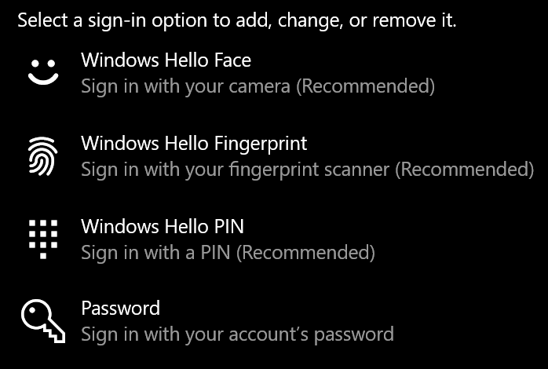
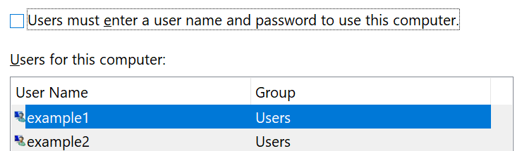

# Parola kullanmadan Windows 10 oturum açma

Başlangıçta parola yazmamak için Windows varsa PIN, yüz tanıma veya parmak izi gibi Windows Hello güvenli oturum açma seçeneklerindan birini öneririz. Güvenli oturum açma özelliğini gerçekten devre dışı bırakmak için aşağıdaki "Oturum açmada otomatik olarak oturum Windows 10" yönergelerine bakın.

**Hesap Windows Hello alternatifleri için güvenlik sağlama**

Oturum açma **Ayarlar > hesapları > gidin (veya** buraya [tıklayın).](ms-settings:signinoptions?activationSource=GetHelp) Kullanılabilir oturum açma seçenekleri listelenir. Örneğin:

Yapılandırmak için seçeneklerden birini tıklatın veya dokunun. Parolayı bir sonraki Windows açsanız veya kilidini açsanız bile, parola yerine yeni seçeneği kullanabilirsiniz. 

**E-postada otomatik olarak oturum Windows 10**

**Not:** Otomatik oturum açma kullanışlı bir oturum açmadır, ancak özellikle de bilgisayarınıza birden çok kişi tarafından erişilse bir güvenlik riski getirir. 

1. Görev çubuğunda Başlat **düğmesine** tıklayın veya dokunun.

2. Kullanıcı Hesapları penceresini açmak için **netplwiz** yazın ve Enter tuşuna basın.

3. Kullanıcı **Hesapları'nın** altında, hesap başlatıldığında otomatik olarak oturum açmasını istediğiniz Windows tıklayın.

4. "Kullanıcıların bu bilgisayarı kullanmak için kullanıcı adı ve parola girmeleri gerekir" onay kutusunun işaretini kaldırın.

    

5. **Tamam**'a tıklayın. Seçtiğiniz hesabın parolasını girmeniz ve onaylamanız istenir. Bitirmek **için Tamam'a** tıklayın. Bir Windows 10 başlatıldığında, seçtiğiniz hesapta otomatik olarak oturum açılır.
