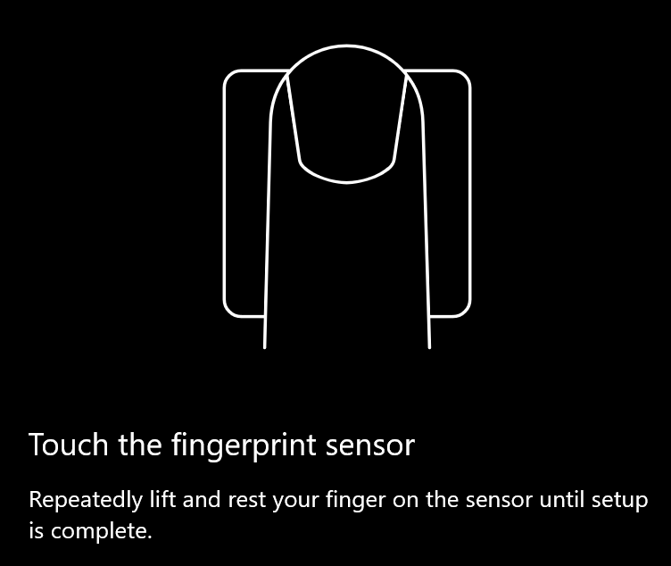
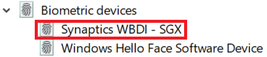

# Windows 10'da parmak izi kilidi açma seçeneğini kullanma

**Windows Hello Parmak İzi Tanımayı Etkinleştirme**

Windows 10'un kilidini parmak izinizi kullanarak açmak için windows hello parmak izi kilidini en az bir parmağınızı ekleyerek (Windows'un tanımasını öğrenmesine izin vererek) ayarlamanız gerekir. 

1. Oturum açma **seçenekleri > Hesaplar ve > ayarlar'a gidin (veya** buraya [tıklayın).](ms-settings:signinoptions?activationSource=GetHelp) Kullanılabilir oturum açma seçenekleri listelenir. Örneğin:

    

2. Windows Hello Parmak **İzi Tanıma'ya tıklayın veya** dokunun, ardından Ayarla **öğesine tıklayın.** Windows Hello kurulum penceresinde, Başla **'ya tıklayın.** Parmak izi algılayıcısı etkin hale gelecektir ve parmağınızı algılayıcıya şu şekilde koyabilirsiniz:

   

3. Parmağınızı tekrar tekrar taramanızı soracak şekilde yönergeleri izleyin. Bu tamamlandığında, oturum açma için kullanmak istediğiniz diğer parmaklarınızı ekleme seçeneğiniz olur. Windows 10'da bir sonraki oturum açsanız, bu şekilde parmak izinizi kullanma seçeneğiniz olur.

**Windows Hello Parmak İzi Tanıma oturum açma seçeneği olarak kullanılamıyor**

Oturum açma seçeneklerinde Windows Hello Parmak İzi İşareti seçeneği gösterilmiyorsa, Windows bilgisayarınıza bağlı herhangi bir parmak izi okuyucusu/tarayıcısı farkında değildir veya sistem ilkesi bunun kullanımını engellemektedir (örneğin, bilgisayarınız çalışma alanınız tarafından yönetiliyorsa). Sorun gidermek için: 

1. Görev çubuğunda **Başlangıç** düğmesini seçin ve Cihaz **Yöneticisi'ni arayın.**

2. Cihaz Yöneticisi'ni açmak için **öğesine tıklayın veya dokunun.**

3. Cihaz Yöneticisi'nde, Biyometrik cihazları köşeli çift ayraçlarına tıklayarak genişletin.

   

4. Parmak izi tarayıcınız Synaptics WBDI tarayıcı gibi biyometrik bir cihaz olarak listelenmiş olmalı:

   

5. Parmak izi tarayıcınızın gösterilmezse ve tarayıcı bilgisayarınızla tümleşikse, bilgisayar üreticisinin web sitesine gidin. Bilgisayar modelinize uygun teknik destek bölümünde, yük makineniz olan bir tarayıcı için Windows 10 sürücüsü aratırsınız.

6. Tarayıcı pc'den ayrı ise (USB ile takılı) sahip olduğunuz tarayıcı modeline uygun Windows 10 cihaz sürücüsü yazılımını bulmak ve yüklemek için tarayıcı üreticisinin web sitesine gidin.
