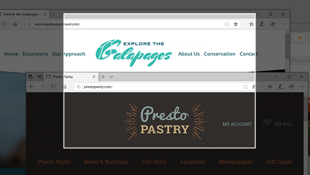
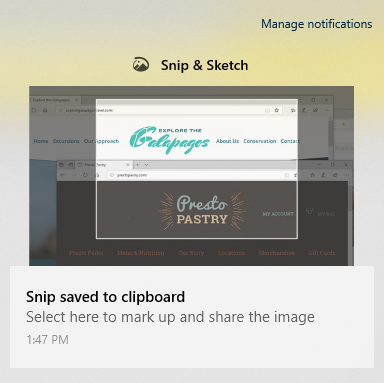

# Görüntüleri yakalamak, işaretlemek ve paylaşmak için Snip & Sketch'i kullanma

Ekran çizimi artık **Snip & Sketch**olarak adlandırılır. **Hızlı bir şekilde bir snip almak için:**

1. Windows **logo tuşuna + Shift + S**tuşuna basın. Ekranınızın karartMa ve imlecin çapraz olarak görüntülendiğini görürsünüz. 

2. Kopyalamak istediğiniz alanın kenarında bir nokta seçin ve imleci sol tıklatın. 

3. Yakalamak istediğiniz alanı vurgulamak için imlecinizi taşıyın. Yakaladığınız alan ekranınızda görünür.

   

Kesip aldığınız resim panonuza kaydedilir ve bir e-posta ya da belgeye yapıştırılamaya hazır dır. 

**Görüntüyü görüntülemek veya görüntülemek istiyorsanız:** 

- Görev çubuğunun sağ tarafındaki bildirimler simgesine tıklayın; sonra sadece yakalanan resmi tıklatın. Snip & Sketch uygulamasında snip açılır.

   
