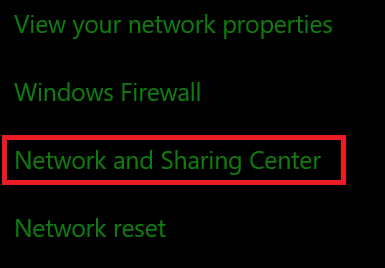
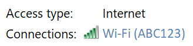
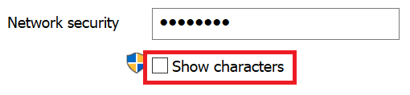

# Ağ Wi-Fi parolanızı e-posta Windows 10

1. Bilgisayarınızın Windows 10 bilgisayarınıza bağlı olduğundan emin Wi-Fi olun.

2. İnternet **Ayarlar > Durumu'& gidin > sizi** oraya götürmemizi için  buraya tıklayın veya dokunun.)

3. Ağ **ve Paylaşım Merkezi'ne tıklayın.**

    

4. Ağ **ve Paylaşım Merkezi'nde,** **Connections**'ın yanında kablosuz ağ adının görebilir. Örneğin, ağınız "ABC123" olarak adlandırılmışsa, şunları bkz:

    

    Durum penceresini açmak için kablosuz ağ Wi-Fi tıklayın. 

5. Durum Wi-Fi, Kablosuz Özellikler **'e tıklayın,** Güvenlik **sekmesine tıklayın** ve Karakterleri göster **öğesini seçin.**

    

